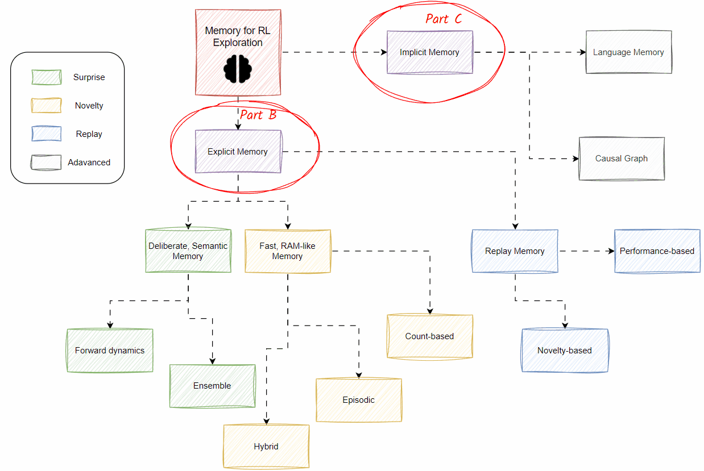

Powered by the high-capacity representation of deep learning and advanced computing infrastructure, current reinforcement learning agents demonstrate mastery in learning intricate policies that map from complex state spaces to vast action spaces. However, they necessitate hundreds of millions or even billions of environmental steps to kickstart the learning process, resulting in prolonged exploration periods. This is feasible only in simulation scenarios, proving challenging for real-world applications such as robotics or industrial planning. It is crucial to optimize the exploration process to enable the adoption of current RL techniques in real-world settings, providing intrinsic mechanisms to motivate agents to exhibit reasonable behaviour at the earliest opportunity. 

Viewing intrinsic exploration through the lens of memory, akin to human cognition, is important for understanding the efficiency of self-motivated RL agents. Human-like memory systems enable agents to retain valuable experiences, learn from past interactions, and expedite the adaptation process, significantly influencing many aspects of RL. Analyzing intrinsic motivation from a memory perspective not only aligns RL approaches with human-like exploration but also opens vast avenues for further investigation, pushing the boundaries not only of RL but also of AI at large.

